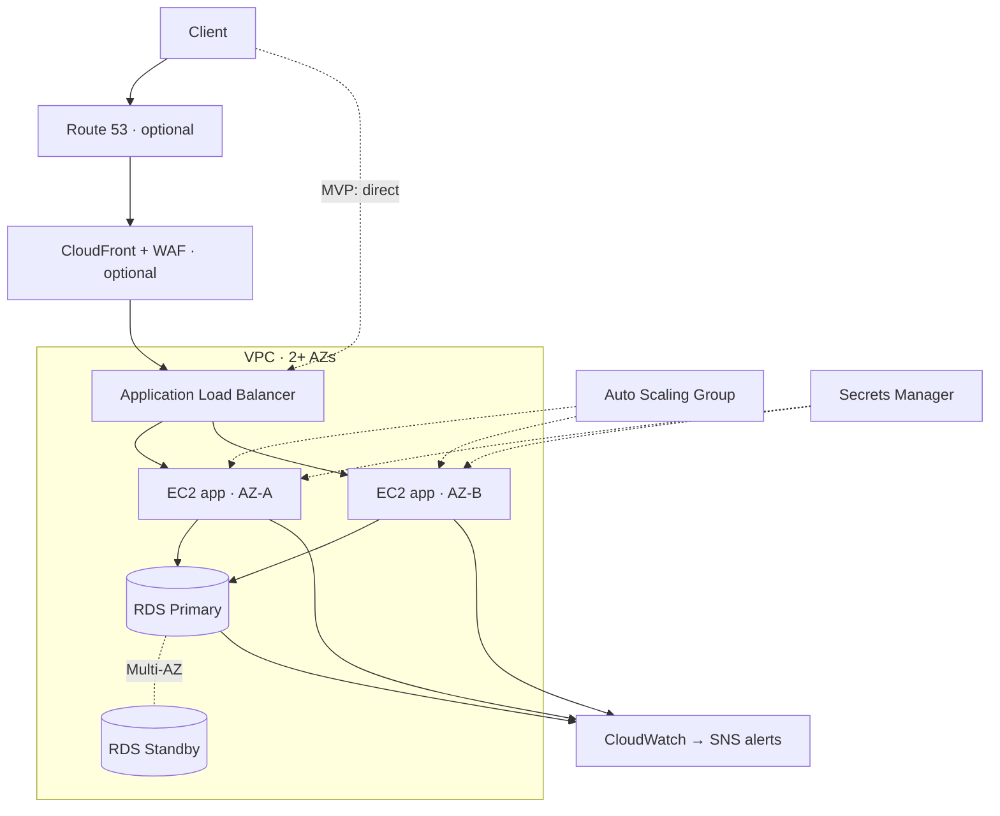

# FortifyStack ⚡ - Highly Available 3-Tier Web Platform on AWS

> A production-grade, self-healing web architecture on AWS - Route 53 → CloudFront/WAF → Application Load Balancer → auto-scaling EC2 across multiple Availability Zones → Multi-AZ RDS - **100% defined in Terraform**. Survives instance and AZ failures, deploys with zero downtime, and scales automatically under load.

<p>


</p>

## Why this exists

Most small AWS setups are a single EC2 instance that dies with its Availability Zone. FortifyStack is the **reproducible, highly available alternative**: one `terraform apply` stands up a load-balanced, auto-scaling, Multi-AZ web platform with monitoring and alerting.

## Architecture



Full details: **[docs/architecture.md](docs/architecture.md)**.

## Features

- **High availability** - app + data tiers span ≥2 AZs; unhealthy instances auto-replaced; optional Multi-AZ RDS with automatic failover.
- **Auto scaling** - target-tracking on CPU (and optionally ALB request count); scales out under load, back in when idle.
- **Zero-downtime deploys** - rolling ASG instance refresh on every change.
- **Secure by default** - private app/data subnets, tight security-group chain, IMDSv2 enforced, DB credentials in Secrets Manager, SSM Session Manager instead of SSH, optional WAF.
- **Observability** - CloudWatch dashboard + alarms (5xx, unhealthy hosts, CPU, RDS storage) → SNS email.
- **100% Terraform** - modular (`network`, `security`, `data`, `compute`, `edge`, `observability`), remote state, reusable across environments.
- **CI/CD** - GitHub Actions with OIDC (no stored keys): fmt → validate → tfsec → plan → gated apply.

## Tech stack

Terraform · AWS (VPC, ALB, EC2 Auto Scaling, RDS PostgreSQL, Secrets Manager, CloudWatch, SNS, IAM, CloudFront, WAF, ACM, Route 53) · Amazon Linux 2023 · a tiny Python demo app · k6 for load testing · GitHub Actions.

## Quick start

```powershell
# 1. Install Terraform + AWS CLI, then configure AWS credentials (aws configure)
# 2. (optional) remote state backend:
cd bootstrap && terraform init && terraform apply && cd ..

# 3. Deploy:
cd terraform/envs/dev
copy terraform.tfvars.example terraform.tfvars   # edit owner / alarm email
terraform init
terraform apply

# 4. Open it:
terraform output app_url
terraform output dashboard_url

# 5. Tear down when done (stops all cost):
terraform destroy
```

Refresh the app page - the **serving instance and AZ rotate** while the visit counter (in RDS) stays shared, proving load balancing plus a common database.

## Resilience built in

- **Kill an instance** → the Auto Scaling Group replaces it automatically; no downtime.
- **Lose an Availability Zone** → traffic keeps serving from the other AZ.
- **Database failover** → Multi-AZ RDS promotes its standby automatically.
- **Deploys** → rolling instance refresh keeps the app serving throughout.
- **Traffic spikes** → autoscaling adds instances on CPU/request load, then scales back in.

## Configuration - MVP vs. advanced (toggle in `terraform.tfvars`)

| Capability | MVP (default) | Advanced (flip a flag) |
|---|---|---|
| Compute | ASG of 2 × t3.micro | scale range, request-count scaling |
| Database | RDS single-AZ | `multi_az = true` (automatic failover) |
| Edge | ALB over HTTP | `enable_edge = true` → CloudFront + WAF + ACM + Route 53 HTTPS |
| NAT | single shared | `one_nat_per_az = true` |

## Cost

Default settings ≈ **$30–70/mo if left running** (ALB ~$16, NAT ~$32, RDS + 2× t3.micro). **Destroy when idle** to stay near $0 - the whole stack rebuilds from one `terraform apply`. See the cost notes in [docs/architecture.md](docs/architecture.md).

## Repository layout

```
fortifystack/
├── app/                    # tiny Python demo app (installed via user-data)
├── bootstrap/              # S3 + DynamoDB remote-state backend (run once)
├── terraform/
│   ├── modules/            # network · security · data · compute · edge · observability
│   └── envs/dev/           # environment wiring + variables
├── load/                   # k6 load test
├── .github/workflows/      # CI/CD (validate, tfsec, plan, gated apply)
├── docs/architecture.md    # architecture deep-dive
└── Makefile
```

## License

MIT - see [LICENSE](LICENSE).
