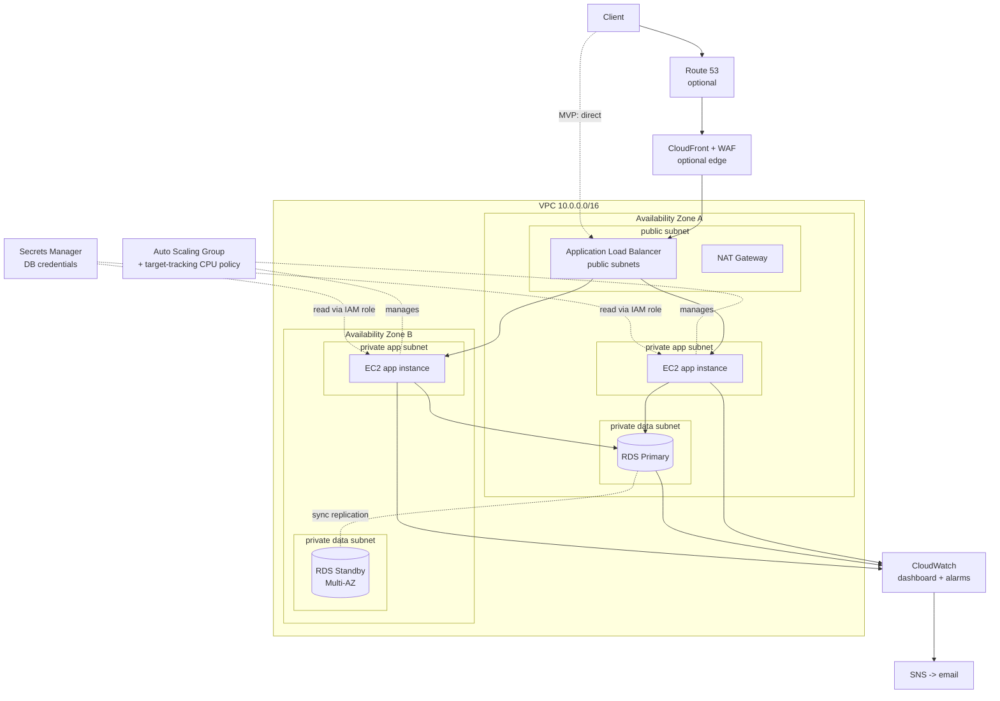

# FortifyStack - Architecture

## Overview

A highly available 3-tier web platform on AWS, fully defined in Terraform:

- **Edge (optional/advanced):** Route53 → CloudFront (CDN + TLS) → WAF.
- **Web/LB:** internet-facing Application Load Balancer in public subnets.
- **App tier:** EC2 Auto Scaling Group across ≥2 AZs in private subnets, self-healing and load-balanced. App runs as a systemd service installed via user-data.
- **Data tier:** RDS PostgreSQL (Multi-AZ optional) in isolated private subnets; credentials in Secrets Manager, read by instances via their IAM role.
- **Observability:** CloudWatch dashboard + alarms → SNS email.

## Diagram

## Request flow

1. Client resolves the app (Route53 → CloudFront when edge enabled, else the ALB DNS name directly).
2. CloudFront terminates TLS and forwards to the ALB over HTTP (private AWS network); WAF filters malicious/abusive traffic.
3. The ALB health-checks `/health` and routes to a healthy instance in either AZ.
4. The instance fetches DB credentials once at boot from Secrets Manager (via its instance role - no secrets on disk), connects to RDS, records the visit, and renders the page.
5. Metrics flow to CloudWatch; breaches notify via SNS email.

## Design decisions & trade-offs

| Decision | Why | Alternative |
|---|---|---|
| EC2 ASG (not Fargate) | Classic 3-tier; no container tooling needed | ECS Fargate |
| Single NAT gateway (default) | Cheaper for non-prod | One NAT per AZ (`one_nat_per_az=true`) for egress HA |
| Secrets Manager for DB creds | No secrets in AMI/user-data/code | SSM Parameter Store (cheaper, fewer features) |
| Multi-AZ RDS optional | Cost control for non-prod; toggle on for automatic failover | Always Multi-AZ in prod |
| CloudFront terminates TLS | Avoids needing a public cert on the ALB; adds CDN + WAF | ACM cert directly on ALB HTTPS listener |
| IMDSv2 required | Blocks SSRF-style metadata theft | IMDSv1 (insecure) |
| SSM Session Manager (no SSH) | No open port 22, no key management | Bastion host + SSH |

## Security posture

- App + data tiers in private subnets; only the ALB is internet-facing.
- Security-group chain: ALB → app (only ALB SG) → RDS (only app SG). No open CIDRs beyond the ALB's 80/443.
- Encryption at rest (RDS + state bucket via KMS); TLS in transit at the edge.
- Least-privilege instance role (SSM + read one secret). IMDSv2 enforced.
- Optional WAF (managed common rules + rate limiting) on CloudFront.

## High availability

- ≥2 AZs for app + data subnets.
- ASG min 2, spread across AZs; unhealthy instances auto-replaced (ELB health check).
- Multi-AZ RDS provides an automatic standby with failover.
- Rolling instance refresh = zero-downtime deploys.

## What's MVP vs advanced here

- **MVP (default vars):** VPC (2 AZ) + ALB + ASG(2) + RDS single-AZ + CloudWatch. HTTP via ALB DNS.
- **Advanced (flip the flags):** `multi_az=true`, `enable_edge=true` (CloudFront+WAF+ACM+Route53 HTTPS), `one_nat_per_az=true`, request-count autoscaling. Cross-region snapshot DR is a planned future iteration.
